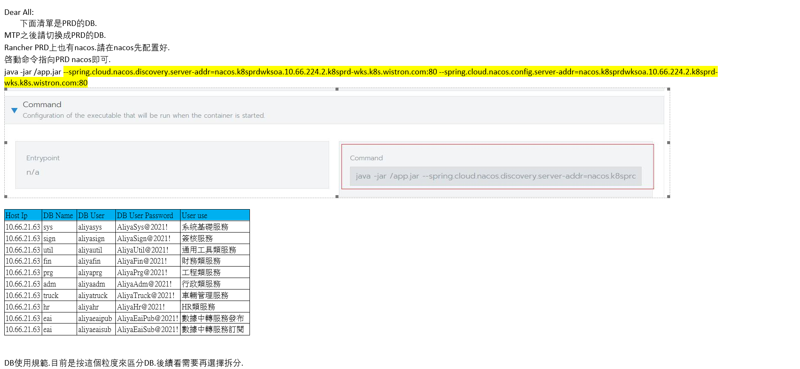

# Aliya

This project is initialized with [Ant Design Pro](https://pro.ant.design). Follow is the quick guide for how to use.

## 環境準備

安裝依賴:

>WKS鏡像 http://10.66.20.189:4001/repository/npm-group/

```bash
yarn
```


### 啓動項目
> 請注意多環境切換

```bash
yarn start
```


## 開發規範

> 有需求可以daily scrum meeting說明.

1. 禁止私自修改config文件
1. 禁止私自添加第三方依賴
1. 禁止私自升級依賴版本
1. 禁止私自使用ant design技術棧之外的組件
1. 禁止私自添加樣式(比如背景顏色等)
1. 頁面文件夾第一個字母大寫.
1. 目錄文件夾第一個字母小寫.
1. 必須使用typescript語法.
1. 請有意識的去修正頁面的語法錯誤.哪怕不影響運行
1. 頁面中不要使用hardcode的url

## DB Info



## More

You can view full document on our [official website](https://pro.ant.design). And welcome any feedback in our [github](https://github.com/ant-design/ant-design-pro).
